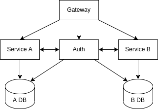
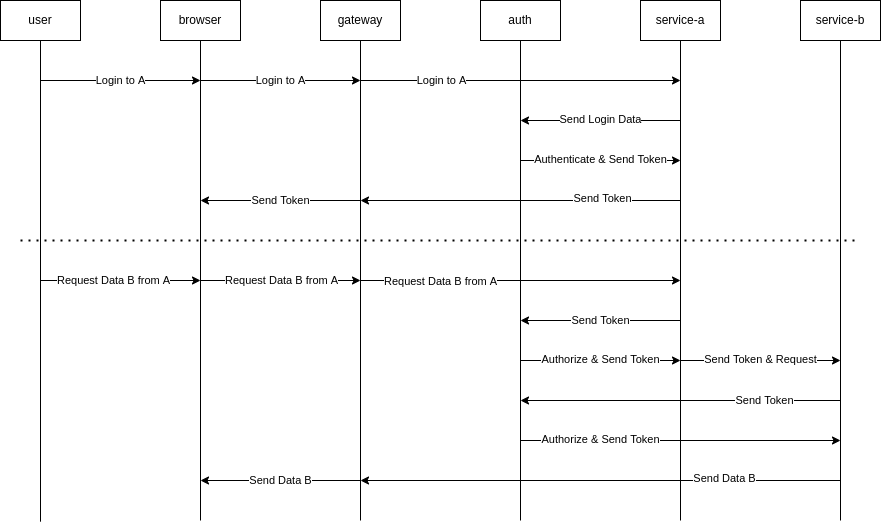

# Inter-service Authentication in Microservices using JSON Web Token

Bintang Pradana Erlangga Putra ([Belajar+](http://belajarplus.id))

---

## Background

## Concept

### Architecture Diagram

### Sequence Diagram

## Experiment
